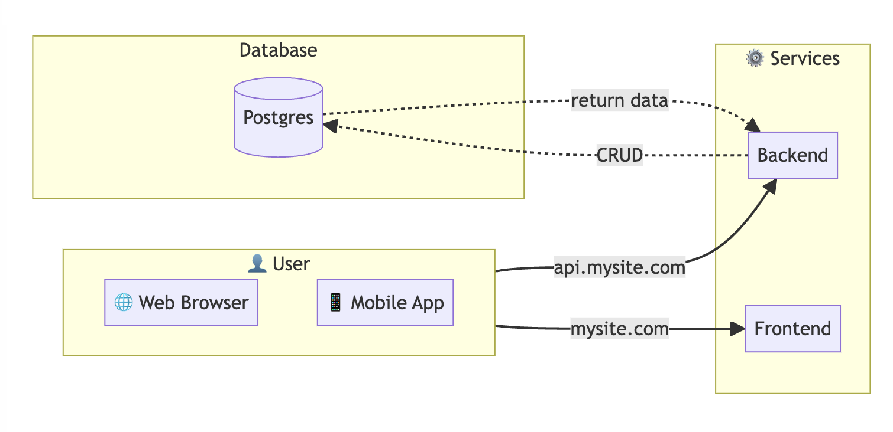

# System Design

## System Design



```
graph LR
    subgraph User[👤 User]
        WB[🌐 Web Browser]
        MA[📱 Mobile App]
    end
   
    subgraph Server[⚙️ Services]
        Frontend[Frontend]
        Backend[Backend]
        
    end

    subgraph Database
        DB[(Postgres)]
    end

    User -->|api.mysite.com| Backend
    User -->|mysite.com| Frontend

    Backend -.->|CRUD| DB
    DB -.->|return data| Backend
```

## Database Design

```
Table users {
  id int [pk, increment]
  username varchar
  created_at timestamp
  updated_at timestamp
}
```