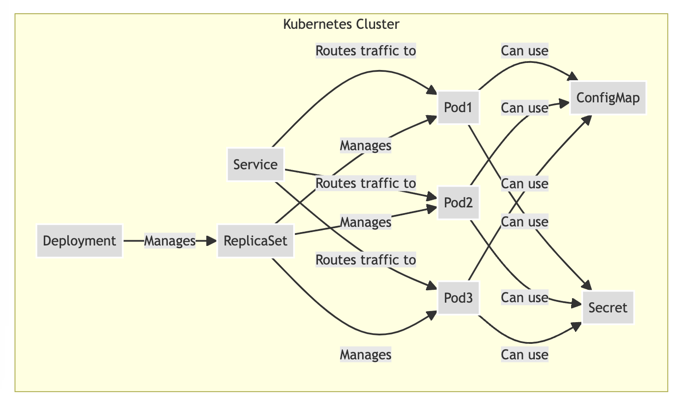

# Kubenetes Tutorial

Kubernetes, often abbreviated as K8s, provides an open-source, extensible platform for managing containerized workloads and services, facilitating both declarative configuration and automation. It orchestrates computing, networking, and storage infrastructure, providing a robust and scalable environment for deploying microservices and distributed applications. This Kubernetes tutorial aims to guide beginners through the fundamental concepts and practical aspects of deploying and managing applications in a Kubernetes environment.

## Deployments, Pods and Services

* Pods: The smallest deployable units in Kubernetes that can host one or more containers, sharing the same network IP and storage space.

* ReplicaSets: Ensure that a specified number of identical pods are running at any given time, handling pod failures by replacing them to maintain the desired state.

* Deployments: Manage the desired state of applications through ReplicaSets, enabling updates to Pods and ReplicaSets, and providing features like rollback and scaling.

* Services: Provide stable network endpoints by assigning persistent IP addresses to ephemeral pods, enabling communication and load balancing among them.