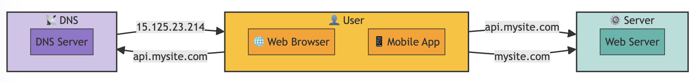

# Single Server



```
graph LR
    style User fill:#FFC107,stroke:#333,stroke-width:2px
    style WB fill:#FFA000,stroke:#333,stroke-width:1px
    style MA fill:#FFA000,stroke:#333,stroke-width:1px
    style Server fill:#B2DFDB,stroke:#333,stroke-width:2px 
    style WS fill:#4DB6AC,stroke:#333,stroke-width:1px
    style DNS fill:#D1C4E9,stroke:#333,stroke-width:2px
    style D fill:#9575CD,stroke:#333,stroke-width:1px

    subgraph User[👤 User]
        WB[🌐 Web Browser]
        MA[📱 Mobile App]
    end

    User -->|api.mysite.com| Server
    User -->|mysite.com| Server

    subgraph Server[⚙️ Server]
        WS[Web Server]
    end

    User -->|api.mysite.com| DNS
    DNS --> |15.125.23.214| User

    subgraph DNS[📡 DNS]
        D[DNS Server]
    end
```